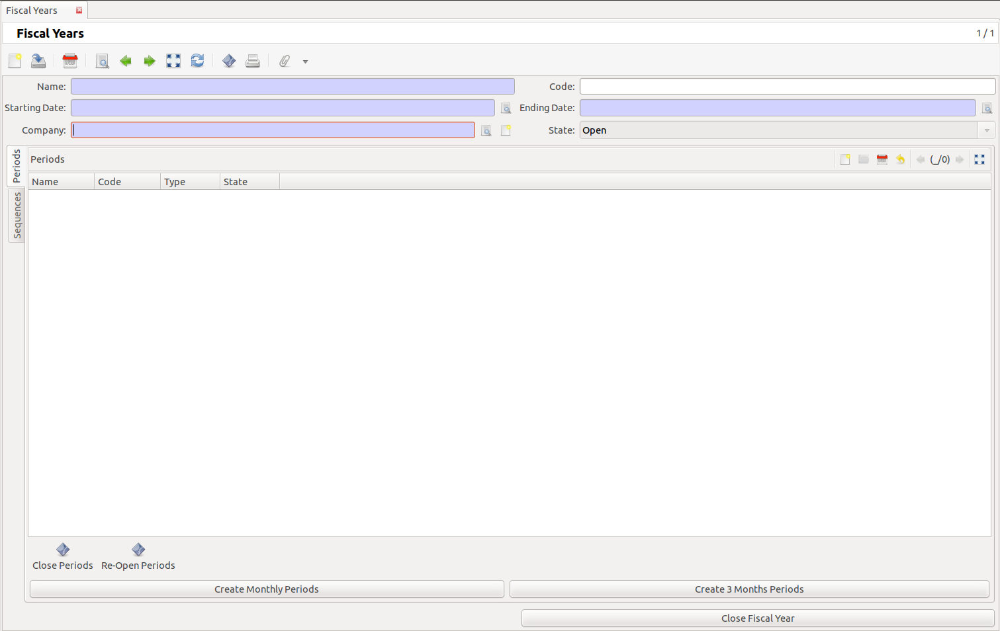
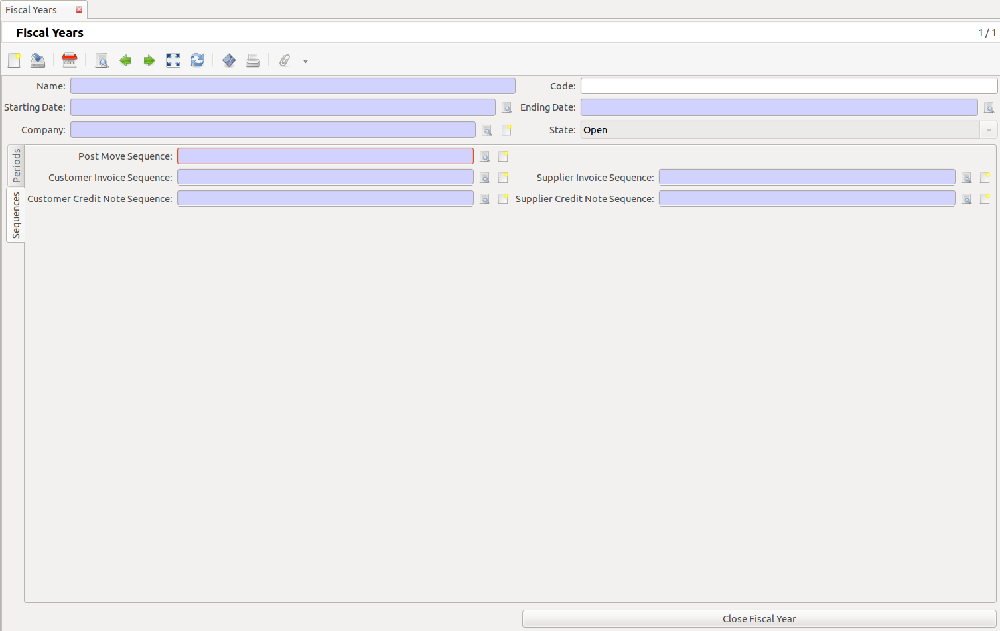

Configuring Accounts
====================
The settings in the accounting module define fundamentals for most of your accounting needs.
To be able to use your accounting system without problems, we first have to create a fiscal year and
accounting periods.

Fiscal Years
------------
A fiscal year aggregates a set of periods that are included between two dates. A Fiscal Year can be Open or Closed. Closing a fiscal year will close all the corresponding periods - once a period is closed,
users can not make any further changes in that fiscal period.
Menu > Financial Management > Configuration > Fiscal Years > Fiscal Years
Double click on New Fiscal Year.

   
   The Periods tab of the Fiscal Years screen

Tab Periods

* Name: The name of the fiscal year. For example: 2011
* Code: The fiscal year code, useful for fast data entry and searching.
* Starting Date: 01-01-2011
* Ending Date: 31-12-2011
* Company: The organisation for which the fiscal year is defined.
* State: The state can be Open or Closed. When you start accounting in this period it must be Open.

Before you can create Periods you must first create the Sequences.

Sequences
"""""""""

   
   The Sequences tab of the Fiscal Years screen

In this tab you can create sequences that are used for numbering, for example invoices (INV0001).

When you try to save a record and fields become red, this means you have to fill these fields before you can save the form.
For each sequence click on the Create a new record button.

Post Move Sequences: The sequence to use for numbering moves in this fiscal year.

* Sequence Name: Post Move What is handy to use ???
* Prefix: PM
* Suffix: What is handy to use ???

Click on the :guilabel:`OK` button.

Customer Invoice Sequence:

* Sequence Name: Customer Invoice
* Prefix: INV
* Suffix: What is handy to use ???

Click on the :guilabel:`OK` button.

Supplier Invoice Sequence:

* Sequence Name: Supplier Invoice
* Prefix: INV
* Suffix: What is handy to use ???

Click on the :guilabel:`OK` button.

Customer Credit Note Sequence:

* Sequence Name: Customer Credit Note
* Prefix: CRE
* Suffix: ???

Click on the :guilabel:`OK` button.

Supplier Credit Note Sequence:

* Sequence Name: Supplier Credit Note
* Prefix: CREN
* Suffix: ???

Click on the :guilabel:`OK` button.

Tab Periods
Click on the Create monthly Periods button.

Periods
"""""""
:menuselection:`Menu --> Financial Management --> Configuration --> Fiscal Years --> Periods`

Select a period by double clicking on it.

A period is mainly defined by a Starting and an Ending date, a Fiscal Year, a Type and a State (Open or
Closed ).

The type can be Standard or Adjustement: Periods of the type Standard on the same fiscal year can not overlap. Period of type Adjustement can overlap other periods and are typically used for all the
accounting moves that must be created when closing a fiscal year. By default, the system uses only Standard period when creating moves.
Each account move must be linked to a period and a move must be created on an open period.

With the button Close Periods you can close a selected period, accounting for that period is not possible anymore. You can use the Re-Open Periods button to open a selected period again.

With the Next record button you can select the next Period.

When you are done, click on the Save this record button.

Account
-------
Account Type
""""""""""""
When the Chart of Accounts is installed correctly most of the fields are filled automatically.
Menu > Financial Management > Configuration > General Account > Account Types > Account Types

The Account Type defines the structure of the accounting reports.
Select an Account Type by double clicking on it.

* Name: The name of the Account type (most of the time this is an accepted standard name).
* Sequence: A sequence number 
* Company: The organisation for which the account type is used.
* Parent: Parent Account type
* Display Balance: A selection that allow to choose how the balance should be computed (Debit - Credit or Credit - Debit)
* Balance Sheet: A checkbox that tells if accounts of this type must appear at the top level of the Balance Sheet report.
* Income Statement: A checkbox that tells if accounts of this type must appear at the top level of the Income Statement report.
