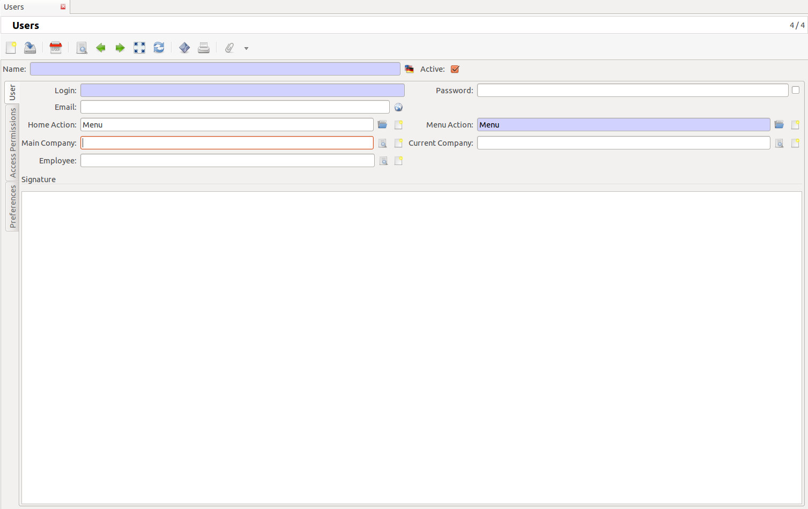
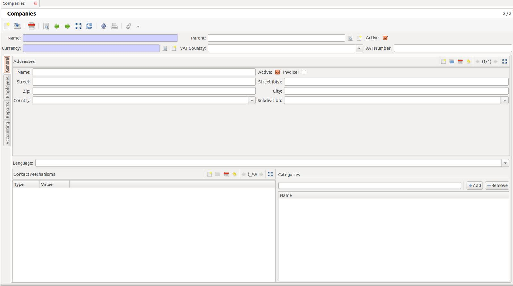
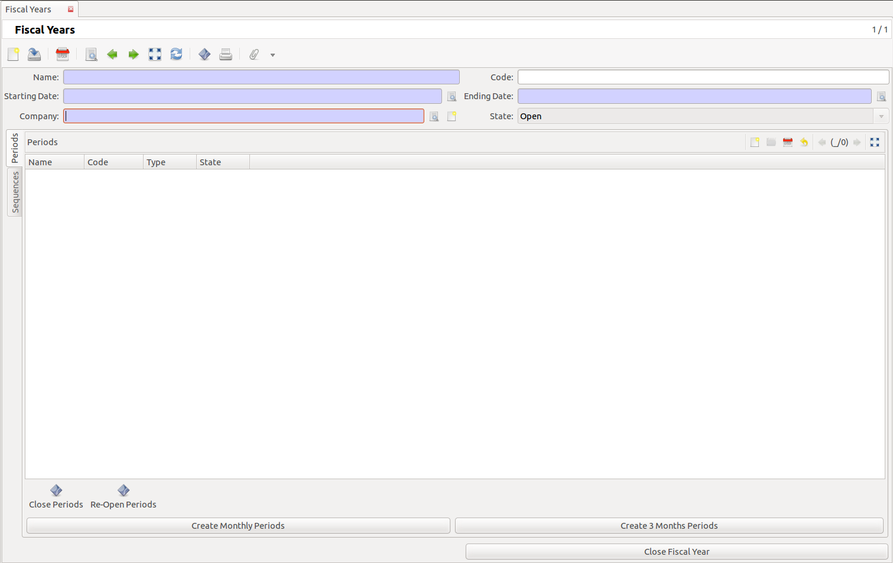

.. Tryton Administration Manual documentation master file, created by
   sphinx-quickstart on Fri Oct  7 14:50:28 2011.
   You can adapt this file completely to your liking, but it should at least
   contain the root `toctree` directive.

Welcome to the Tryton Administration Manual!
========================================================

Contents:

.. toctree::
   :maxdepth: 2

Introduction
============
This document describes the way of administration and configuration of the Tryton system. With the help of this manual you create a working application that can support your organisation processes.
This manual is primarily targeted on the Tryton administrator. This manual can also be used to write a Tryton user manual.

Contributors
------------
+----------------+-----------------------------------+
|Name            |Contributions                      |
+================+===================================+
|Anthony Schrijer|* Initial setup of the manual      |
| 		 |* Basic configuration of the system|
|                |* Configuring accounts             |
|                |* Configuring Party management     |
|                |* Creating Products                |
|                |* Writing style conventions        |
|                |* Style sheet                      |
+----------------+-----------------------------------+

Presumptions
============
In this chapter we mention the presumptions that are made before you can do the configuration of the Tryton system.

In this manual most settings are made with a European viewpoint; adapt the settings to your local needs.

* This manual is written for the Tryton server version 2.0 with the corresponding Tryton client (GUI) as the user interface.
* With the Tryton client you must be able to make a connection to a database and you must be able to log in.

Tryton installation specifications
----------------------------------
When Tryton is installed there is initially no database. In this configuration is expected that you have created a database with these settings:

* Tryton Server Password: the password that is used during installation of the Tryton server.
* Tryton database name: databasename
* Tryton administrator name: admin
* Password administrator: password used for the administrator during database installation.
* Standard language: English (choosen in this manual for ease of use and as starting point for translations of this manual).

Basic Configuration
===================
When a new database is created in Tryton and when you log in that database for the first time, you get the screen:
*Welcome to the module configuration wizard!*

Click on the *OK* button if you want to configure modules.

Creating users
--------------
The first configuration step in the wizard is *Add users*.
If you want to create new users click on the *OK* button.

   
   The User tab on the Users screen

On the screen Users, go to the User tab:

User Tab
""""""""

    * Name: The real name of the user.
    * Login: The login name of the user.
    * Password: The user login password.
    * Email: The e-mail address of this user.
    * Home action: The initial “home” screen for this user, usually set to “Menu” (see below) - for instance, for a user primarily entering sales, this can be set to Sales or New Sale.
    * Menu action: The menu viewed by the user.

Check the Active box if you want this user to be active. You can block the access of an user by unchecking this box.

Access Permissions Tab
""""""""""""""""""""""

Under Groups click on the *Add* button and select the groups to which the user will belong.
Select existing groups or create a new one.

Under Rules click on the *Add* button to add a rule.
With a rule you can manage in detail what kind of access a user has on the different modules/fields.
Click on the New button and you get the Record rules screen.

    * Model: The model description.
    * Global: Check this box so the rule becomes global and every user must follow this rule.
    * Default: If you check this box the rule will be added to all users by default.
    * Read access: Check this box if you want to give read access to model.
    * Write access: Check this box if you want to give write access to the model.
    * Create access: Check this box if you want to give create access to the model.
    * Delete access: Check this box if you want to give delete access to the model.
    * Name: Name of the rule.

Preferences Tab
"""""""""""""""

    * Language: Select the system language for the user.
    * Timezone: Select the timezone in which the user works.

When you have finished all the tabs for this user then click on the Add button. The user will be added to the system.

A new empty User screen will appear for adding another user. If you do not want to add more users click on the End button.

Installing modules
------------------
After you have added users with the wizard, a list of installable modules appear.

To start a minimal system select first an accounting module by double clicking on the name and then click on the *Mark for Installation* button.

* account_nl # Select the accounting module for your country.

Click on the tab Dependencies.

When you select a module to install, other modules on which it is dependent will be installed too (in this case the module account will be installed too).

When you have selected the module you want to install, click on the button *Perform Pending Installation/Update*. The screen System Upgrade appears with all the modules that will be installed.
Click on the button Start Upgrade.
When the module is installed, the wizard Welcome to the module configuration wizard! appear.
Click on the OK button if you want to configure modules.

Creating a Company
------------------
The wizard to create a company starts. This "company" will be the organisation for which you will use the
Tryton system.

The company submodule extends the party module and add several fields: the currency, the list of
employees and header and footer texts for reports. There is also a parent company field which allow to
setup companies in a tree structure. The company model represents the actual organisation the users of
Tryton are members of.

   
   The General tab of the Companies screen

Companies screen
""""""""""""""""
* Name: Your organisation name
* Parent: The parent company (if one exists).
* Currency: The currency that your organisation uses.
* VAT Country: select the abbreviation for your country
* VAT Number: When you select a VAT Country abbreviation you have to fill this field.

General Tab

In the group Addresses.
This address will show up later in your invoices.

* Name: Your organisation name
* Active: Check this box if you want to be this organisation active
* Invoice: Check this box if this is an address where invoices should be sent 
* Street: Streetname of your organisation
* Street (bis): Alternative streetname of your organisation
* ZIP: Post code of your organisation
* City: City where your organisation is situated
* Country: Country where your organisation is situated
* Subdivision: State or province where your organisation is situated

Language: select one of the available languages.
In the group Contact mechanisms.
These contact mechanisms are the various ways (Email, Phone, Skype) by which a company can be
contacted - they appear on your reports (invoices, etc.)
In the group Categories.
These categories can be used to organize or “tag” parties (including
companies).
Click on the tab Employees.
Tab Employees
Click on the button Create a new record, the Employee screen apears.

* Name: First and last name of the employee
* Active: Check this box if the employee is active in the organisation.

In the screen Employee click on the tab General.

General Tab

In the group Addresses.

* Name: The employee name
* Active: Check this box if this employee is active
* Invoice: Check this box if you can invoice this employee
* Street: Streetname for your employee
* Street (bis): Alternative streetname for your employee
* ZIP: Post code of the employee
* City: City where your employee is situated
* Country: Country where your employee is situated
* Subdivision: State or province where your employee is situated

Language: select one of the available languages.
In the group Contact mechanisms.
These are the various ways (Email, Phone, Skype) by which this employee can be contacted.
In the group Categories.
These categories can be used to organize or “tag” employees.

Tab Accounting

* VAT Country: Select the country abbreviation for the VAT tax.
* VAT Number: VAT number of the employee ??? (subcontractor?)
* Invoice Payment Term: Term for a client to pay the invoice
* Supplier Payment Term: Term for a supplier to pay the invoice
* Account receivable: Select an account for the receivables
* Account payable: Select an account for the payables (is this the account for the salaries?)
* Customer Tax Rule: Select the appropriate tax rule for your situation
* Supplier Tax Rule: Select the appropriate tax rule for your situation

Click on the OK button when done.
Tab Reports
Under Header you fill in the text that you want to have in the header of your reports.
under Footer you fill in the text that you want to have in the footer of your reports.
Tab accounting

* VAT Country: Select the country abbreviation for the VAT tax.
* VAT Number: VAT tax number of your organisation
* Invoice Payment Term: Term for a client to pay the invoice
* Supplier Payment Term: Term for a supplier to pay the invoice
* Account receivable: Select an account for the receivables
* Account payable: Select an account for the payables
* Customer Tax Rule: Select the appropriate tax rule for your organisation situation
* Supplier Tax Rule: Select the appropriate tax rule for your organisation situation

When ready with all the tabs click on the Save this record button.

Installing a Chart of Accounts
------------------------------
Before we go further with installing and configuring modules we are going to create a chart of account.
Go to: Financial management > Configuration > General account > Create Chart of Account from Template.
Double click to start the wizard.
In the screen Create Chart of Account:

* Company: Select the organisation for which you create the chart of accounts.
* Account Template: Select the template that you need for the accounting in your country.

Click on the button Create.

Language settings for the system
--------------------------------
If you have users that want to use different languages in the system, you first have to set these
languages active and translatable.
Go to the (left of the screen) Menu and select Administration > Localization > Languages (double click).
Select for the language of your choice the Translatable and Active check boxes. Save your settings.

Selecting other modules
-----------------------
You can now select the modules you need for your organisation processes.
Menu > Administration > Modules > Modules
To create a basic system, select and install the following modules:

* account_invoice

When you have selected a module you want to install, click on the Perform Pending Installation/Update
button, and then the Start Upgrade button.
When the module is installed, a “Welcome to the module configuration wizard!” message will appear.
Click on the OK button if you want to configure the module.

Access management
-----------------
To create a new group that has access to certain modules go to:
Administration > Modules > Modules access (double click)
In the Models access screen click on the button Create a new record.

* Model: Select a model to which the group will have access.
* Group: The group name.
* Read access: Check this box if you want to give read access to the model.
* Write access: Check this box if you want to give write access to the model.
* Create access: Check this box if you want to give create access to the model.
* Delete access: Check this box if you want to give delete access to the model.

When you create for the Group a new record you get the Group screen.
Go to the tab Access Permissions.

Configuring Accounts
====================
The settings in the accounting module define fundamentals for most of your accounting needs.
To be able to use your accounting system without problems, we first have to create a fiscal year and
accounting periods.

Fiscal Years
------------
A fiscal year aggregates a set of periods that are included between two dates. A Fiscal Year can be Open or Closed. Closing a fiscal year will close all the corresponding periods - once a period is closed,
users can not make any further changes in that fiscal period.
Menu > Financial Management > Configuration > Fiscal Years > Fiscal Years
Double click on New Fiscal Year.

   
   The Periods tab of the Fiscal Years screen

Tab Periods
* Name: The name of the fiscal year. For example: 2011
* Code: The fiscal year code, useful for fast data entry and searching.
* Starting Date: 01-01-2011
* Ending Date: 31-12-2011
* Company: The organisation for which the fiscal year is defined.
* State: The state can be Open or Closed. When you start accounting in this period it must be Open.

Before you can create Periods you must first create the Sequences.

Sequences
"""""""""
.. figure:: images/fiscal-year-sequences.png
   :scale: 50 %
   
   The Sequences tab of the Fiscal Years screen

In this tab you can create sequences that are used for numbering, for example invoices (INV0001).

When you try to save a record and fields become red, this means you have to fill these fields before you can save the form.
For each sequence click on the Create a new record button.

Post Move Sequences: The sequence to use for numbering moves in this fiscal year.
* Sequence Name: Post Move What is handy to use ???
* Prefix: PM
* Suffix: What is handy to use ???
Click on the OK button.

Customer Invoice Sequence:
* Sequence Name: Customer Invoice
* Prefix: INV
* Suffix: What is handy to use ???
Click on the OK button.

Supplier Invoice Sequence:
* Sequence Name: Supplier Invoice
* Prefix: INV
* Suffix: What is handy to use ???
Click on the OK button.

Customer Credit Note Sequence:
* Sequence Name: Customer Credit Note
* Prefix: CRE
* Suffix: ???
Click on the OK button.

Supplier Credit Note Sequence:

* Sequence Name: Supplier Credit Note
* Prefix: CREN
* Suffix: ???
Click on the OK button.

Tab Periods
Click on the Create monthly Periods button.

Periods
"""""""
Menu > Financial Management > Configuration > Fiscal Years > Periods (Double click)
Select a period by double clicking on it.
A period is mainly defined by a Starting and an Ending date, a Fiscal Year, a Type and a State (Open or
Closed ).
The type can be Standard or Adjustement: Periods of the type Standard on the same fiscal year can
not overlap. Period of type Adjustement can overlap other periods and are typically used for all the
accounting moves that must be created when closing a fiscal year. By default, the system uses only
Standard period when creating moves.
Each account move must be linked to a period and a move must be created on an open period.
With the button Close Periods you can close a selected period, accounting for that period is not possible
anymore. You can use the Re-Open Periods button to open a selected period again.
With the Next record button you can select the next Period.
When your done click finally on the Save this record button.

Account
-------
Account Type
""""""""""""
When the Chart of Accounts is installed correctly most of the fields are filled automatically.
Menu > Financial Management > Configuration > General Account > Account Types > Account Types

The Account Type defines the structure of the accounting reports.
Select an Account Type by double clicking on it.

* Name: The name of the Account type (most of the time this is an accepted standard name).
* Sequence: A sequence number ???
* Company: The organisation for which the account type is used.
* Parent: Parent Account type
* Display Balance: A selection that allow to choose how the balance should be computed (Debit -
Credit or Credit - Debit)
* Balance Sheet: A checkbox that tells if accounts of this type must appear at the top level of the
Balance Sheet report.
* Income Statement: A checkbox that tells if accounts of this type must appear at the top level of the Income Statement report.

Indices and tables
==================

* :ref:`genindex`
* :ref:`modindex`
* :ref:`search`

